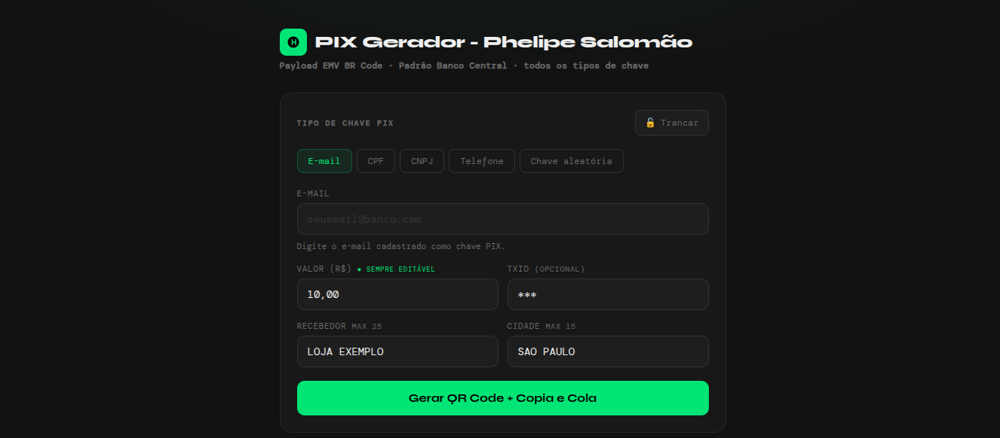
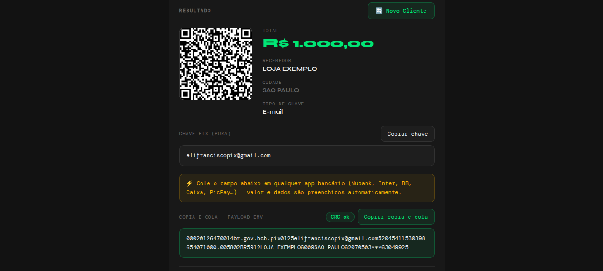

<p align="center">
  
  
  
  
  
  
</p>

# 📱 PIX Gerador — Solução de Cobranças PIX

> Conjunto completo de ferramentas web para geração de cobranças **PIX** com **QR Code** e **Copia e Cola** (Payload EMV BR Code), seguindo o padrão oficial do **Banco Central do Brasil**.

---

## ✨ Funcionalidades

| Funcionalidade | Descrição |
|---|---|
| ✅ **QR Code PIX** | Geração de QR Codes dinâmicos para pagamento |
| ✅ **Copia e Cola** | Payload EMV completo — compatível com todos os bancos |
| ✅ **5 tipos de chave** | Email, CPF, CNPJ, Telefone (+55) e Chave Aleatória (UUID) |
| ✅ **Validação em tempo real** | Feedback visual imediato com badges de validação |
| ✅ **Trava de configuração** | 🔒 Bloqueia campos para uso repetitivo em PDVs |
| ✅ **Comprovante** | PDF, impressão e visualização do comprovante |
| ✅ **CRC16 automático** | Validação do payload com checksum |
| ✅ **Payload debug** | Visualização decodificada do payload EMV |
| ✅ **Offline** | 100% funcional sem internet (após carregar) |
| ✅ **Responsivo** | Desktop, tablet e mobile |

---

## 📦 Arquivos

### 🔥 [`Gerador-Pix.html`](Gerador-Pix.html) — Tema Dark/Minimalista
Versão enxuta com design escuro e acentos verde neon. Ideal para uso rápido e profissional.



### 💜 [`PDV-PIX.html`](PDV-PIX.html) — Tema Light/Profissional
Versão completa design claro com gradiente roxo — otimizada para pontos de venda (PDV).



> ℹ️ Os arquivos são **autônomos** — basta abrir no navegador. Nenhuma instalação ou servidor necessário.

---

## 🚀 Como usar

### Rápido
```bash
# Opção 1: Abrir direto no navegador
open Gerador-Pix.html    # macOS
xdg-open Gerador-Pix.html  # Linux
start Gerador-Pix.html     # Windows

# Opção 2: Servir localmente (opcional)
npx serve .
```

### Passo a passo
1. **Abra** `Gerador-Pix.html` ou `PDV-PIX.html` no navegador
2. **Escolha o tipo** de chave PIX (Email, CPF, CNPJ, Telefone ou Aleatória)
3. **Preencha** os dados da cobrança (chave, valor, recebedor, cidade)
4. **Trave a configuração** 🔒 para uso repetitivo (opcional)
5. **Clique em** "Gerar QR Code + Copia e Cola"
6. **Compartilhe** o QR Code ou copie o payload Copia e Cola

---

## 🔧 Campos

| Campo | Tipo | Obrigatório | Limite | Descrição |
|-------|------|:-----------:|:------:|-----------|
| **Chave PIX** | Texto/Número | ✅ | Variável | Email, CPF, CNPJ, Telefone ou chave aleatória |
| **Valor (R$)** | Número | ✅ | ≥ R$ 0.01 | Sempre editável, mesmo com trava ativada |
| **TxID** | Texto | ❌ | 25 char | Identificador opcional da transação |
| **Recebedor** | Texto | ❌ | 25 char | Nome do beneficiário |
| **Cidade** | Texto | ❌ | 15 char | Localização do recebedor |

---

## 🧠 Arquitetura

```
📁 Gerador-De-Pix-Pagamento/
├── 📄 Gerador-Pix.html          ← Tema dark (standalone)
├── 📄 PDV-PIX.html              ← Tema light (standalone)
├── 📁 assets/
│   └── 📁 js/
│       └── 📄 pix-engine.js     ← Engine PIX compartilhada (módulo ES)
├── 📁 file/                     ← Screenshots
├── 📄 README.md
├── 📄 LICENSE                   ← MIT
├── 📄 package.json              ← Metadados do projeto
├── 📄 .gitignore
└── 📄 .editorconfig
```

### 🎯 Engine compartilhada

O coração do projeto é o [`pix-engine.js`](assets/js/pix-engine.js), um módulo ES puro que contém:

- **Gerador de Payload EMV** conforme especificação do Banco Central
- **CRC16-CCITT** para validação do payload
- **Validação de chaves** PIX (CPF, CNPJ, Email, Telefone, UUID)
- **Máscaras de formatação** para CPF, CNPJ e Telefone
- **Decodificador** do payload EMV para debug
- **Gerador de QR Code** via QRCode.js com fallback

```javascript
import { gerarPayload, validarChave } from './assets/js/pix-engine.js'

// Gerar cobrança PIX
const { payload, chave } = gerarPayload('email', 'user@bank.com', 10.50, 'LOJA ABC', 'SAO PAULO', '***')
console.log(payload)  // "00020126360014br.gov.bcb.pix..."

// Validar chave
const { ok, m } = validarChave('cpf', '12345678909')
console.log(ok ? '✓ Válido' : '✗ ' + m)
```

---

## 🛠️ Tecnologias

| Tecnologia | Uso |
|---|---|
| **HTML5** | Estrutura semântica com ARIA |
| **CSS3** | Design responsivo, variáveis, gradientes |
| **JavaScript (ES Modules)** | Lógica da aplicação e engine PIX |
| [QRCode.js](https://github.com/davidshimjs/qrcodejs) | Geração de QR Code no cliente |
| [html2canvas](https://html2canvas.hertzen.com/) | Captura de tela para PDF |
| [jsPDF](https://github.com/parallax/jsPDF) | Geração de PDF do comprovante |

---

## 📱 Compatibilidade

| Navegador | Status |
|---|---|
| Chrome / Chromium | ✅ Suportado |
| Firefox | ✅ Suportado |
| Safari | ✅ Suportado |
| Edge | ✅ Suportado |
| Mobile (iOS/Android) | ✅ Suportado |

---

## ⚠️ Observações

- **🔒 Segurança:** Nenhum dado é enviado a servidores — tudo processado localmente
- **📡 Offline:** Funciona sem internet após o primeiro carregamento (arquivos locais)
- **🏦 Padrão BC:** Payload 100% compatível com o padrão EMV BR Code do Banco Central
- **🔤 Chave Telefone:** Deve iniciar com código do país (+55)

---

## 🤝 Contribuindo

Contribuições são bem-vindas! Sinta-se à vontade para abrir issues ou pull requests.

```bash
# Clone
git clone https://github.com/RafaelBatistaDev/Gerador-De-Pix-Pagamento.git

# Faça suas alterações
# ...

# Envie
git push
```

---

## 📄 Licença

Distribuído sob licença **MIT**. Veja [`LICENSE`](LICENSE) para mais informações.

---

<p align="center">
  <strong>PIX Gerador</strong> · EMV BR Code · Padrão BACEN<br>
  <sub>Desenvolvido por <a href="https://github.com/RafaelBatistaDev">Rafael Batista</a></sub>
</p>
